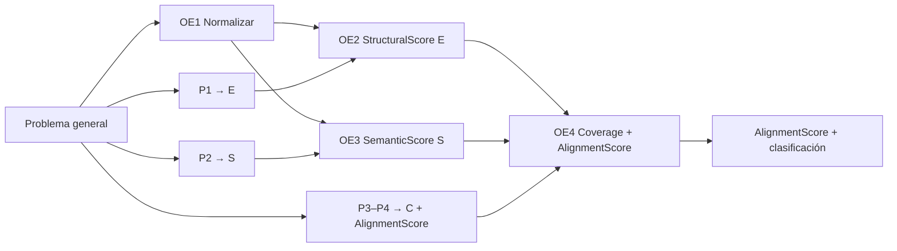

# Guía para exponer la Matriz de Consistencia

**Grupo 9.2** · Alex Mancilla · Jack Paitan  
**Documento de apoyo** (no es el entregable formal; complementa el Excel)  
**Archivo Excel:** `Matriz_Consistencia_Grupo9.2.xlsx`  
**Modelo de alineación (figuras):** `figuras_alineacion_openapi_bian.pdf`

---

## 1. ¿Qué es y para qué sirve?

La **matriz de consistencia** demuestra que el plan de tesis es **coherente de punta a punta**: cada fase responde a un problema, tiene un objetivo claro, produce un resultado verificable y define cómo se medirá el éxito.

El **producto central del proyecto** es un **modelo de alineación** entre contratos OpenAPI bancarios y el modelo de referencia BIAN (Service Domain), cuyo resultado es un **AlignmentScore** calculado a partir de tres componentes:

| Score | Significado |
|-------|-------------|
| **SemanticScore (S)** | Similitud de significado OpenAPI ↔ BIAN |
| **StructuralScore (E)** | Correspondencia de jerarquía y organización |
| **CoverageScore (C)** | Conceptos BIAN cubiertos por el contrato |

**Fórmula:** `AlignmentScore = α·S + β·E + γ·C` con `α + β + γ = 1`

**Clasificación:** Alta (≥0,80) · Media (0,60–0,79) · Baja (0,40–0,59) · Nula (<0,40)

> Mensaje clave: *«No medimos solo si un YAML es válido; calculamos cuánto se alinea un contrato OpenAPI bancario con BIAN y en qué nivel.»*

---

## 2. Cómo leer el Excel

| Hoja | Contenido |
|------|-----------|
| **Matriz de consistencia** | Tabla principal — **5 fases** del modelo |
| **Resumen OG-OE** | Problema/objetivo general, OE1–OE4, P1–P4, scores S/E/C |

### Columnas de la tabla principal

| # | Columna | Qué significa en la exposición |
|---|---------|-------------------------------|
| 1 | **Fase** | Etapa del modelo de alineación |
| 2 | **Problema** | Qué falta o qué no se sabe |
| 3 | **Objetivo** | Qué transformación se realiza |
| 4 | **Producto verificable** | Entregable concreto (score, matriz, informe) |
| 5–10 | **VI, estados, VD, hipótesis, métricas, control** | Operacionalización y validez |

---

## 3. Cadena lógica del proyecto

**Problema general:** ¿En qué medida un contrato OpenAPI bancario se alinea con BIAN y bajo qué tipologías hay desalineación?

**Objetivo general:** Diseñar y aplicar el modelo S + E + C → AlignmentScore.

---

## 4. Las cinco fases — guion para exponer

### Fase 1 — Diseño del modelo de alineación

| | |
|---|---|
| **Problema** | No hay modelo documentado para cuantificar alineación OpenAPI bancario ↔ BIAN. |
| **Objetivo** | Diseñar el modelo completo (S, E, C, fórmula, clasificación). |
| **Producto** | Documento del modelo: pipeline y definición de scores. |
| **Qué decir** | «Antes de medir, definimos *qué* medimos y *cómo* se combina en un score final.» |

---

### Fase 2 — Normalización (OE1)

| | |
|---|---|
| **Problema** | OpenAPI (REST) y BIAN SD (negocio) son vistas distintas del mismo dominio. |
| **Objetivo** | Llevar ambos a representaciones comparables. |
| **Producto** | Representaciones normalizadas (endpoints, schemas, behaviors, business objects). |
| **Qué decir** | «No comparamos YAML con YAML a ojo; unificamos vistas en un modelo intermedio.» |

---

### Fase 3 — StructuralScore E (OE2 · P1)

| | |
|---|---|
| **Problema** | Se desconoce la correspondencia de jerarquía y organización. |
| **Objetivo** | Calcular **StructuralScore (E)**. |
| **Producto** | Matriz de correspondencias + E ∈ [0, 1]. |
| **Qué decir** | «E responde P1: ¿la estructura REST refleja el Service Domain?» |

---

### Fase 4 — SemanticScore S (OE3 · P2)

| | |
|---|---|
| **Problema** | Los nombres pueden no significar lo mismo en negocio. |
| **Objetivo** | Calcular **SemanticScore (S)**. |
| **Producto** | Matriz de similitud + S ∈ [0, 1]. |
| **Qué decir** | «S responde P2: ¿los conceptos de negocio coinciden semánticamente?» |

---

### Fase 5 — CoverageScore, AlignmentScore y clasificación (OE4 · P3–P4)

| | |
|---|---|
| **Problema** | Falta indicador global y escala interpretable. |
| **Objetivo** | Calcular **C**, integrar **AlignmentScore = α·S + β·E + γ·C** y clasificar. |
| **Producto** | C, AlignmentScore, nivel (Alta/Media/Baja/Nula), tipologías. |
| **Qué decir** | «Aquí cerramos el modelo: cobertura de conceptos BIAN + score final ponderado.» |

Ver figura en `figuras_alineacion_openapi_bian.pdf` **pág. 1** (modelo S/E/C → AlignmentScore). Pág. 2–4: detalle metodológico en Cap. 4 (ver `anexos/README.md`).

---

## 5. Tabla resumen

| Fase | Pregunta / OE | Producto principal |
|------|---------------|-------------------|
| 1 | Diseño | Modelo de alineación documentado |
| 2 | OE1 | Representaciones normalizadas |
| 3 | P1 · OE2 | StructuralScore (E) |
| 4 | P2 · OE3 | SemanticScore (S) |
| 5 | P3–P4 · OE4 | CoverageScore (C) + AlignmentScore + clasificación |

---

## 6. Preguntas del docente

**¿Por qué normalizar si ambos pueden ser OpenAPI?**  
Porque se comparan **capas distintas**: contrato REST (objeto de estudio) vs. modelo de negocio BIAN (referencia), no solo sintaxis de archivo.

**¿Qué es el objeto de estudio?**  
Los **contratos OpenAPI bancarios** evaluados contra **Service Domains BIAN** como referencia.

**¿Cuál es el producto final?**  
El **AlignmentScore** y su clasificación por niveles de alineación.

---

## 7. Checklist antes de exponer

- [ ] Excel + PDF de figuras del modelo abiertos
- [ ] Saber explicar S, E, C y la fórmula α·S + β·E + γ·C
- [ ] Ubicar P1–P4 y OE1–OE4 en hoja «Resumen OG-OE»
- [ ] Mencionar que la matriz es el **Anexo C**

---

*Documento de apoyo Grupo 9.2 — alineado con `Matriz_Consistencia_Grupo9.2.xlsx` y `figuras_alineacion_openapi_bian.pdf`.*
